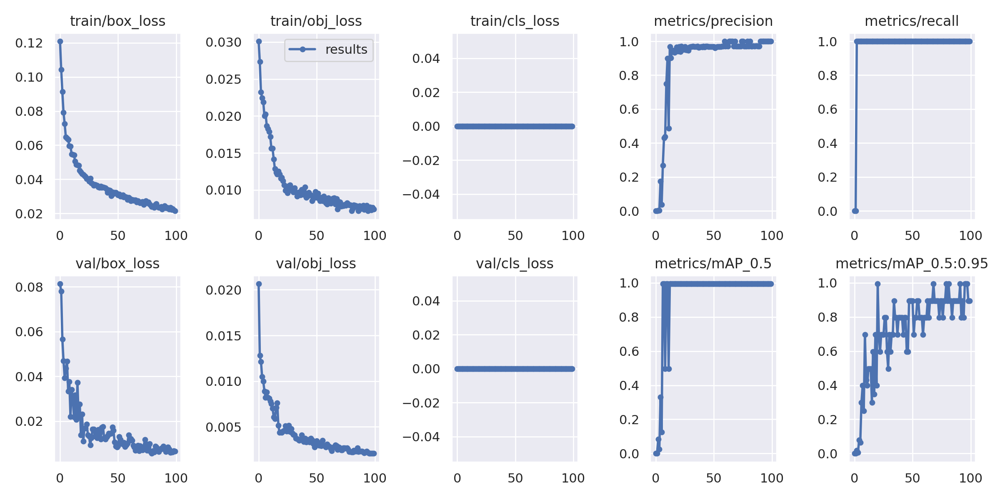

# InterIIT JLR CV
This repository contains all the files involved in solving the Computer Vision Part of the JLR Problem Statement in InterIIT Techmeet 11.0.

## Charging Port Detection
This folder contains the Yolo model and dataset used for charging port detection. 

Yolov5 has been used to detect the CCS2 charging port. Yolo model detects the port and a bounding box is generated. The coordinates of bounding box is used to get the approximate center of the charging port. 

### Libraries Used
`Pytorch`

### Dataset creation
The images of the CCS2 charging port have been taken from various angles and at different distances from the camera, for the purpose of capturing a comprehensive representation of the port's design and appearance. 

### Data Augumentions
- Adaptive Equalization
- Filter null (8%)
- Grayscaling
- Vertical and horizontal flip
- Rotation (-25 to +25 degrees)
- Vertican shear (-13 to +13 degress)
- Horizontal shear (-9 to +9 degrees)
- Hue (-25 to 25 degrees)
- Exposure (-12% to 12%)
- Cutout (4 boxes with 30% size each)

### Dataset split
- Training dataset: 99%
- Validation dataset: 0.5%
- Test dataset: 0.5%

### Accuracy - 92%+
- Maximum mAP50-90 = 0.995




## Charging Port Orientation
This folder contains the Custom CNN Regression model and dataset made by us for estimating the orientation of the Charging Port.

### Libraries Used  
`TensorFlow Keras`, `Pandas`, `Numpy`

### Dataset Creation and augumentation
CCS2 port images have been taken from a distance of 20cm from the camera at various yaw angles (-30 to 30 with a difference of 0.5 degrees each), pitch angles (0, 2, 4 and -10 degrees) and with zero roll (because other than 0 degree, other angles for roll not possible). Images have been augumented with a rotation angle of range 3 degrees, width and height shift range of 0.05 and zoom range from 75% to 100%.

### Dataset Split
- Training Dataset: 99.9%
- Validation Dataset: 0.05%
- Test Dataset: 0.05%

### Model Architecture
The model summary is shown:
```
_________________________________________________________________
 Layer (type)                Output Shape              Param #   
=================================================================
 input_1 (InputLayer)         [(None, 128, 128, 3)]    0         
                                                                 
 conv2d (Conv2D)              (None, 114, 114, 16)     10816     
                                                                 
 batch_normalization (BatchN  (None, 114, 114, 16)     64        
 ormalization)                                                   
                                                                 
 max_pooling2d (MaxPooling2D  (None, 57, 57, 16)       0         
 )                                                               
                                                                 
 conv2d_1 (Conv2D)            (None, 46, 46, 32)       73760     
                                                                 
 batch_normalization_1 (Batc  (None, 46, 46, 32)       128       
 hNormalization)                                                 
                                                                 
 max_pooling2d_1 (MaxPooling  (None, 23, 23, 32)       0         
 2D)                                                             
                                                                 
 conv2d_2 (Conv2D)            (None, 15, 15, 64)       165952    
                                                                 
 batch_normalization_2 (Batc  (None, 15, 15, 64)       256       
 hNormalization)                                                 
                                                                 
 max_pooling2d_2 (MaxPooling  (None, 7, 7, 64)         0         
 2D)                                                             
                                                                 
 conv2d_3 (Conv2D)            (None, 2, 2, 60)         138300    
                                                                 
 batch_normalization_3 (Batc  (None, 2, 2, 60)         240       
 hNormalization)                                                 
                                                                 
 max_pooling2d_3 (MaxPooling  (None, 1, 1, 60)         0         
 2D)                                                             
                                                                 
 flatten (Flatten)            (None, 60)               0         
                                                                 
 dense (Dense)                (None, 128)              7808      
                                                                
 dropout (Dropout)            (None, 128)              0         
                                                                 
 dense_1 (Dense)              (None, 64)               8256      
                                                                 
 dropout_1 (Dropout)          (None, 64)               0         
                                                                 
 dense_2 (Dense)              (None, 500)              32500     
                                                                 
 dense_3 (Dense)              (None, 3)                1503      
                                                                 
=================================================================
Total params: 439,583
Trainable params: 439,239
Non-trainable params: 344
_________________________________________________________________
```

### Optimizer Used
Adam with learning rate = 0.000005

### Loss function
Mean Sqaured Error

### Error
- Mean Yaw Error ~ 0.61 degree
- Mean Pitch Error ~ 0.66 degree
- Mean Roll Error ~ 0.11 degree
- Mean Error ~ 0.46 degree


## plug_test
This ROS Package is used to test the CV models and algorithms present in this repository.

The following features are implemented in the simulation:
- A custom model of the CCS2 charging plug is spawned.
- A ROS service that can give the depth of any pixel in the image using different approaches.
- Run YOLOv5 detection model in the simulation.
- A ROS node publishing orientation of the plug.
- Test various approaches to check their robustness in various real world situations.

## Geometric Approach
This folder contains the files required for the geometric approach used for orientation estimation of Charging port.

## Graphs
This folder contains all the computer vision graphs acquired during solving the problem statement.